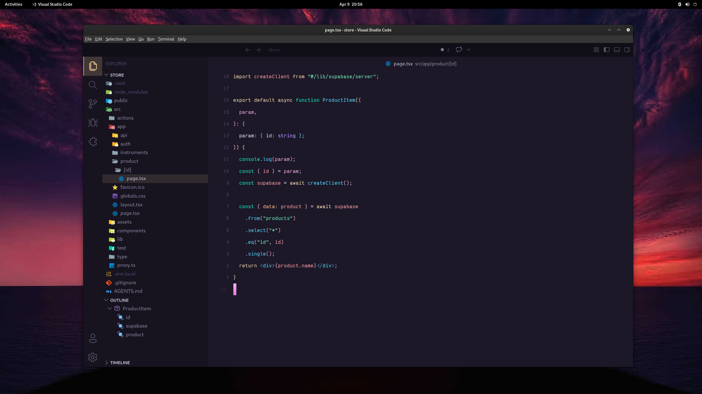

# 💻 My VS Code Setup

Welcome to my personal VS Code configuration! This repository contains my settings, extensions, and themes to keep my web dev environment consistent.

---

## 📸 The Setup
<p align="center">
  
</p>

---

## 🛠️ Key Features
* **Theme:**  beardedbear Theme HC Minuit from 'beardedbear.beardedtheme-10.1.0 extention'
* **Font:**   Victor Mono
* **Icons:**  Material Icon Theme
  
## 📦 Extensions Included
I use a variety of extensions to boost productivity, including:
* **UI/UX:** Customizable status bars and bracket colorizers.
* **Languages:** Support all languages.
* **Utilities:** Prettier, and ESLint. // you can add gitlen later

## 🚀 How to use this config
1. **Clone the repo:** or just copy past the json file into your vscode setting file using cntl + shift + ,
   ```bash
   git clone [https://github.com/Om7gh/my_vscode_config.git](https://github.com/Om7gh/my_vscode_config.git)
